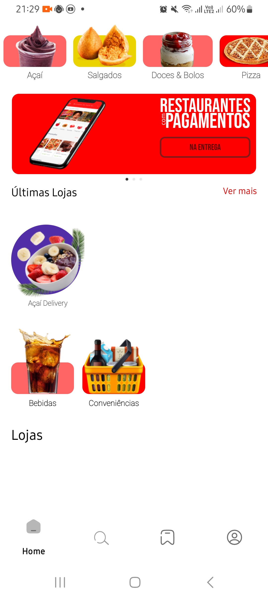
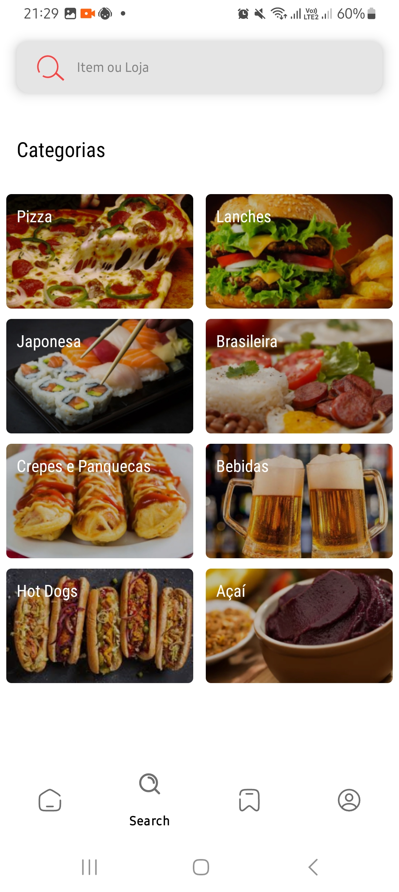
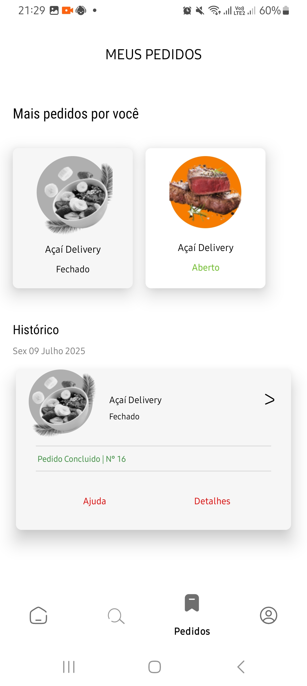

# 📖 Sobre o Projeto
---  
Este projeto é uma réplica funcional da interface de usuário de uma versão não tão recente do aplicativo iFood, desenvolvido com o objetivo principal de aprendizado e aprimoramento em tecnologias nativas do Android. A aplicação recria a experiência visual e a navegação entre as principais telas do famoso aplicativo de delivery de comida.

O foco foi construir uma base sólida, utilizando componentes modernos e as melhores práticas recomendadas pelo Google para o desenvolvimento Android, como a arquitetura de tela única (Single-Activity Architecture).

### 🚀 Tecnologias Utilizadas
---
Este projeto foi construído utilizando um conjunto de ferramentas modernas e essenciais do ecossistema Android:
- Kotlin: Linguagem de programação principal, 100% adotada no projeto por sua sintaxe concisa, segurança e interoperabilidade.
- XML (Extensible Markup Language): Utilizado para a construção declarativa das interfaces de usuário e layouts.
- Fragments: As telas da aplicação foram construídas como componentes modulares e reutilizáveis, permitindo uma interface flexível e eficiente.
- Android Navigation Component: Componente essencial para mapear e gerenciar a navegação entre os diferentes Fragments. Ele centraliza o fluxo do usuário, tornando-o mais visual e fácil de manter.
- Componentes do Material Design 3: Utilização de BottomNavigationView, CardView, ViewPager2 e outros componentes para criar uma interface visualmente consistente e atraente.
- ConstraintLayout: Usado para criar layouts complexos e responsivos com uma hierarquia de Views plana.
- Git e GitHub: Para controle de versão e hospedagem do código-fonte.

### ✨ Funcionalidades Implementadas
---
- Tela Principal (HomeFragment): Exibe categorias, banners promocionais deslizantes (ViewPager2) e listas de restaurantes.
- Navegação Principal: Implementada com BottomNavigationView, permitindo a troca fluida entre as seções: Início, Busca e Perfil.
- Fluxo de Navegação: Mapeamento visual e seguro entre as telas usando o Navigation Component e seu nav_graph.xml.
- Interface Dinâmica: Layouts construídos para se adaptarem a diferentes tamanhos de tela.

#### 📸 Screenshots

|             Tela de Início             |                 Buscas                 |                 Pedidos                 |           Perfil do Usuário            |
|:--------------------------------------:|:--------------------------------------:|:---------------------------------------:|:--------------------------------------:|
|  |  |  |  |


## 🏁 Como Executar o Projeto
---

Para testar ou contribuir com este projeto, siga os passos abaixo:
1. Clone o repositório:
   ```
       git clone https://github.com/SEU-USUARIO/SEU-REPOSITORIO.git
   ```

2. Abra no Android Studio:
3. Inicie o Android Studio.
4. Selecione "Open an Existing Project".
5. Navegue até o diretório onde você clonou o projeto e selecione-o.
6. Sincronize o Gradle:
    - O Android Studio irá sincronizar e baixar as dependências do projeto automaticamente.
7. Execute o aplicativo:
8. Selecione um emulador ou conecte um dispositivo físico.
9. Clique no botão "Run 'app'" (▶️).

### 🎯 Objetivo e Aprendizados
---
O principal objetivo deste projeto foi prático: aplicar e solidificar conhecimentos em arquitetura de aplicativos Android modernos. Os principais aprendizados incluem:
- Gerenciamento de Estado com Fragments: Entender o ciclo de vida e a comunicação entre Fragments.
- Navegação Gráfica: A facilidade e robustez que o Navigation Component traz para gerenciar fluxos complexos.
- Criação de Layouts Responsivos: Utilizar o ConstraintLayout para criar UIs que funcionam em diferentes densidades de tela.
- Boas Práticas: Organização de código, uso de recursos do Android (drawables, strings, styles) e a importância de uma arquitetura bem definida.
## 👤 Autor - Ryan
